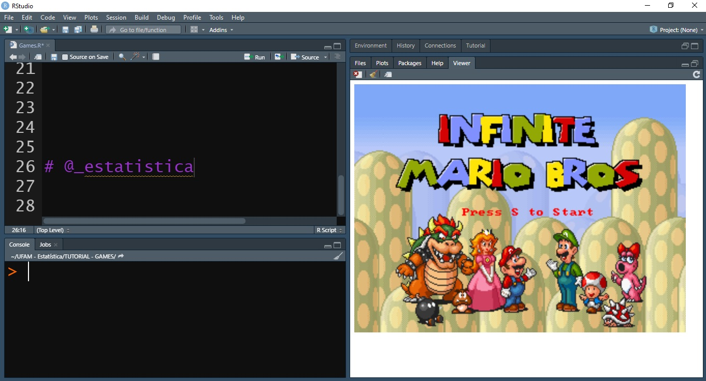

```{r setup, include=FALSE}
knitr::opts_chunk$set(collapse = TRUE)
```



Olá pessoal, tudo bem? Estamos muito animados em tê-los aqui e esperamos que gostem do conteúdo que iremos compartilhar com vocês a partir de hoje.

Nosso primeiro \#post traz uma brincadeira gostosa pra vocês, afinal, programar não precisa ser chato, né? Assim, este post é para mostrar que é possível SIM se divertir com programação em R.

Graças ao [Romain Lesur](https://github.com/Rlesur/Rcade) é possível rodar jogos em HTML5 no R sim! 😍 e de um jeito facim facim.... 😏

A receita de bolo é muito simples....

Você vai precisar de 2 ingredientes importantes: **devtools** + **Rcade.** Desta forma, siga os passos 🚶:

[**Passo 1 -**]{.ul} Verifique se o pacote devtools já está instalado em seu computador, caso contrário, utilize-se o seguinte comando para instalação:

```{r a, eval = FALSE}
# install.packages("devtools")
```

> Nota: Provavelmente em computadores com o sistema operacional Windows seja necessária a instalação/atualização do pacote Rtools. Você pode baixar e seguir as orientações de instalação [clicando aqui](https://cran.r-project.org/bin/windows/Rtools).

[**Passo 2 -**]{.ul} Agora vamos trazer o pacote do [Romain Lesur](https://github.com/Rlesur/Rcade) para fazer o download diretamente do GitHub:

```{r b, eval = FALSE}
devtools::install_github('RLesur/Rcade')
```

Pronto! Agora vamos explorar a lista com todos os jogos disponíveis neste pacote através do comando:

```{r c, eval = FALSE}
Rcade::games
```

Possivelmente vocês vão se deparar com essa lista:

-   2048

-   BoulderDash

-   CathTheEgg

-   Core

-   CustomTetris

-   GreenMahjong

-   Mariohtml5 (aaaaaaaa 😍)

-   Pacman

-   Pond

-   SpiderSolitaire

-   SURVIVOR

E aí, já escolheu o seu jogo favorito? Então o passo final é selecionar o jogo desejado através do comando:

```{r d, eval = FALSE}
# Super Mario
Rcade::games$Mariohtml5
```

> Vale lembrar que na primeira vez que o jogo for selecionado, ele precisará ser instalado (é rapidinho... 😎)

Eu escolhi o jogo do Super Mário (😍) para exemplificar, mas se vocês quiserem quaisquer outros jogos, basta modificar após sinal de "\$" com o nome do joguinho que você deseja (Ex: Rcade::games\$Pacman).

Prontinho!

Diversão garantida e usando o nosso querido R 💖

Gostaram do nosso post?

Chama os zamigos(as) pra jogar também!

Aproveita e acompanhar nossas redes pra ficar ligadinho(a) nas novidades do \#blog

Nos vemos no próximo post! 🚀🥰

💻 By **[A]²** [**E**]{.ul}statística
